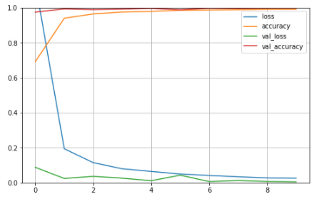
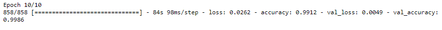
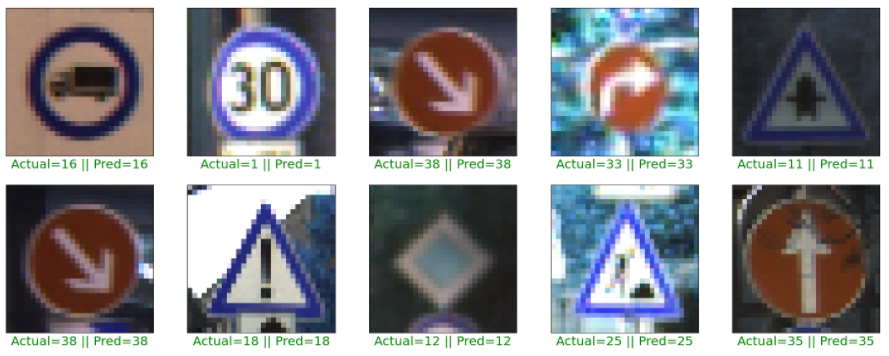
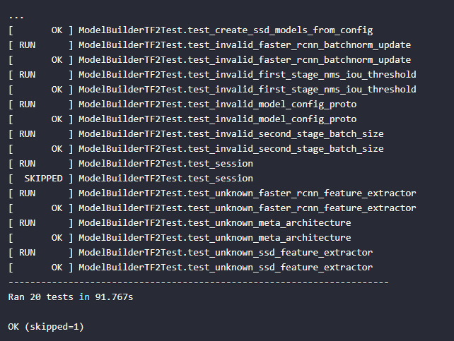
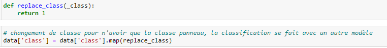
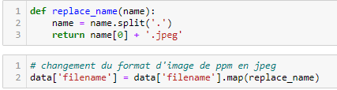
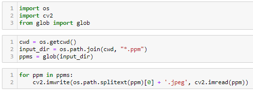
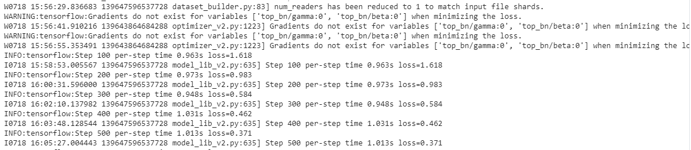

# Reconnaissance panneau de signialisation

## Remerciements
Avant tout, un grand merci à [@PaulSabia](https://github.com/PaulSabia), [@PeregHer](https://github.com/PeregHer) et [@ChainYo](https://github.com/ChainYo) qui nous ont permis de passer les 18h d'entrainement du modèle en nous donnant généreusement leur sauvegarde.<br> 
Ils nous ont également aidé par la suite pour la partie de traitement de l'image.

Ensuite, un grand merci à Gilbert Tanner pour son travail sur la détection d'objet dont a été inspiré la majeur partie du travail effectué que ce soit sur 
[youtube](https://www.youtube.com/watch?v=cvyDYdI2nEI) ou encore encore sur son [blog](https://gilberttanner.com/blog/tensorflow-object-detection-with-tensorflow-2-creating-a-custom-model).

## Modèle de classification

Après avoir traité les images, nous avons mis en place un [modèle](panneau_classification.ipynb) en suivant des exemples d'internet utilisés dans ce genre de projet. Après plus tests, nous avons opté pour
un *learning rate* de 0.001 et 10 *epochs* (l'apprentissage atteint un plateau vers les 10 epochs).


<br>
<br>
Le modèle affiche un val_accuracy de 0.9986 et un score de prédiction de 0.9802 ce qui est plus que satisfaisant.


<br>
<br>
On peut observer qu'il n'y a effectivement aucune erreurs lors du test du modèle



## Modèle de détection
Pour cette partie, nous nous sommes appuyé sur le travail de Gilbert Tanner. Plusieurs étapes sont nécessaires.

### 1. Installation

Tout d'abord nous avons cloné la branche principale du repository de [Tensorflow Models](https://github.com/TannerGilbert/Tensorflow-Object-Detection-API-Train-Model)

`git clone https://github.com/tensorflow/models.git`

**Installation du package pour python**

```
cd models/research
# Compile protos.
protoc object_detection/protos/*.proto --python_out=.
# Install TensorFlow Object Detection API.
cp object_detection/packages/tf2/setup.py .
python -m pip install .
```


https://github.com/protocolbuffers/protobuf/releases


Pour tester l'installation:

`python object_detection/builders/model_builder_tf2_test.py`

Ce qui devrait nous donner si tout se passe bien:



### 2. Les data

#### Récupération des images et traitement

Nous avons récupéré le dataset d'images du site de l'[IFN](https://benchmark.ini.rub.de/gtsdb_dataset.html).

Plusieurs traitements on été nécessaires:

* les informations des images (Path, coordonnées des panneaux, classe des panneaux) dans un fichier .txt
* format des images en .ppm

Dans un premier temps nous avons travaillé sur ce fichier .txt. Nous avons:

* créé des colonnes qui renseignent les dimentions des images
* remplacé les classes de panneaux (de 0 à 42) car on veut que ce modèle ne détermine que s'il y a un panneau ou pas <br>



* remplacé le format de l'image dans le Path pour qu'elles passent de .ppm à .jpeg



* enregistré la nouvelle database dans un fichier csv

Dans un second temps nous avons procédé au chanement de format pour les images. Pour ce faire nous avons utilisé les modules [os](https://docs.python.org/fr/3/library/os.html), cv2 et [glob](https://docs.python.org/fr/3.6/library/glob.html). 


Nous avons donc récupéré le chemin de chaque image, split le nom de celle-ci et enfin remplacé le .ppm par un .jpeg en rajoutant simplement ce dernier.



Enfin nous avons réparti les 900 images dans 2 dossiers (750 pour l'entrainement et 150 pour le test) et clivé le fichier csv en 2 fichiers correspondants.

### 3. Génération des TFRecord

Après avoir créé les fichiers *train_labels.csv* et *test_labels.csv*, nous avons converti les fichier CSV en fichiers TFRecords. Pour ce faire, on va ouvrir le fichier [gererate_tfrecord.py](https://github.com/TannerGilbert/Tensorflow-Object-Detection-API-Train-Model/blob/master/generate_tfrecord.py) et remplacer la fonction `class_text_to_int` par un label unique.

Ensuite nous pouvons générer les fichiers TFRecord en écrivant:<br>
```
python generate_tfrecord.py --csv_input=images/train_labels.csv --image_dir=images/train --output_path=train.record
python generate_tfrecord.py --csv_input=images/test_labels.csv --image_dir=images/test --output_path=test.record
```

Ces deux commandes vont générer un fichier *train.record* et *test.record*.

### 4. L'entrainement
#### Création du Label map

Puisque nous utilisons 2 modèles, un pour la classification et un autre pour pour la détection, il n'y aura qu'une seule catégorie:

```
dico_classes = {
    id: 1
    name: "Panel"
}
```

Ce code va remplacer la fonction dont on parlait dans le point précédant. 

#### Création de la configuration d'entrainement
Il va falloir créer un fichier de configuration. La [configuration de base](https://github.com/tensorflow/models/blob/master/research/object_detection/configs/tf2/ssd_efficientdet_d0_512x512_coco17_tpu-8.config) pour le modèle se trouve dans le dossier [config/tf2](https://github.com/tensorflow/models/tree/master/research/object_detection/configs/tf2). Nous avons copié ce fichier et l'avons mis dans le dossier training/train.

Les changements suivants ont été effectués:

* Ligne 13: on change le nombre de classes par le nombre d'objets que l'on veut détecter (1 dans notre cas)

* Ligne 141: on change fine_tune_checkpoint par le path du fichier model.ckpt:
    * fine_tune_checkpoint: "<path>/efficientdet_d0_coco17_tpu-32/checkpoint/ckpt-0"

* Ligne 143: changer fine_tune_checkpoint_type par detection

* Ligne 182: changer input_path par le path du fichier train.records:
    * input_path: "<path>/train.record"

* Ligne 197: changer input_path par le path du fichier test.records:
    * input_path: "<path>/test.record"

* Ligne 180 et 193: changer label_map_path par le path du label map:
    * label_map_path: "<path>/labelmap.pbtxt"

* Ligne 144 et 189: changer batch_size par une valeur appropriée pour notre machine, comme 4, 8, ou 16.

#### Entrainer le modèle
Pour entrainer le modèle, il faut exécuter la ligne de commande suivante:

```
python model_main_tf2.py --pipeline_config_path=training/ssd_efficientdet_d0_512x512_coco17_tpu-8.config --model_dir=training --alsologtostderr
```

Si tout se passe bien on doit voir:



A partir de cette étape, nous avons utilisé le modèle sauvegardé de Paul, Pereg et Thomas.


### 5. Recherche de panneau

Le résultat de la recherche de panneau est mitigé. Le modèle de détection arrive à trouver la quasi totalité des panneaux mais la classification est beaucoup moins efficace. 


